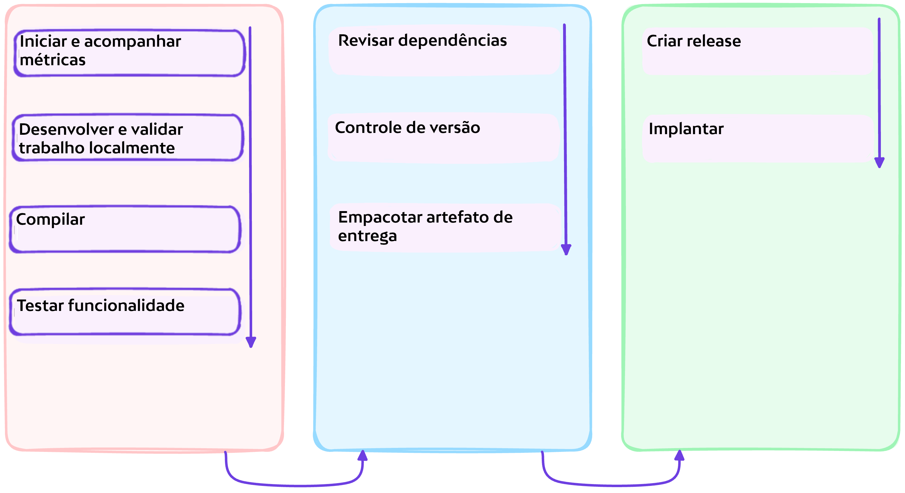
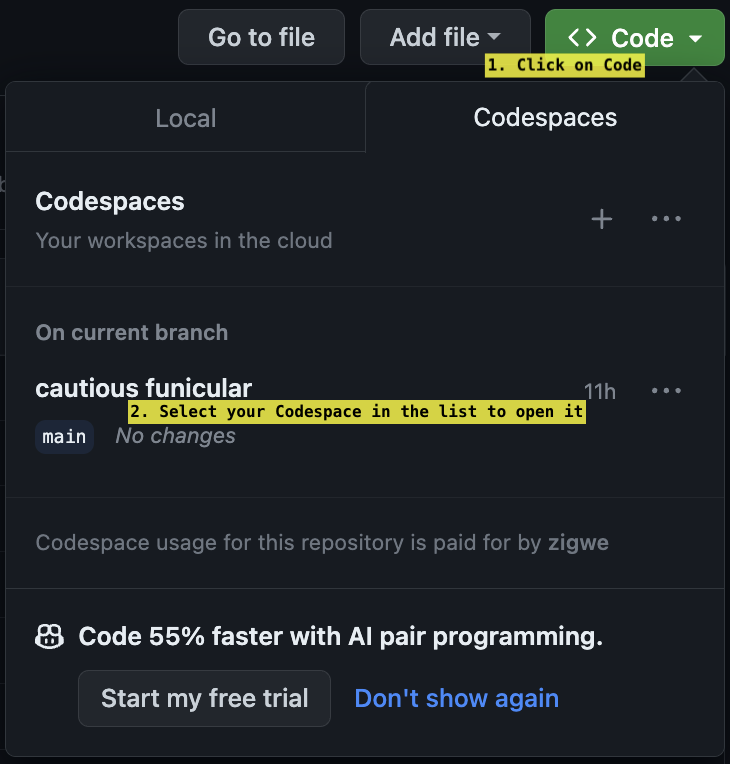
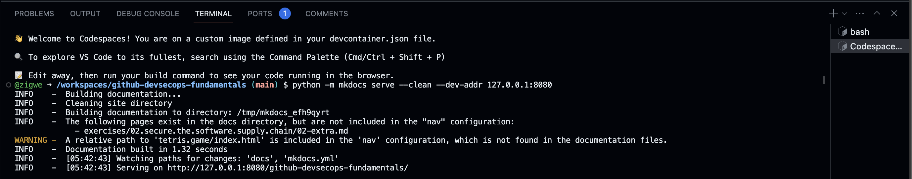
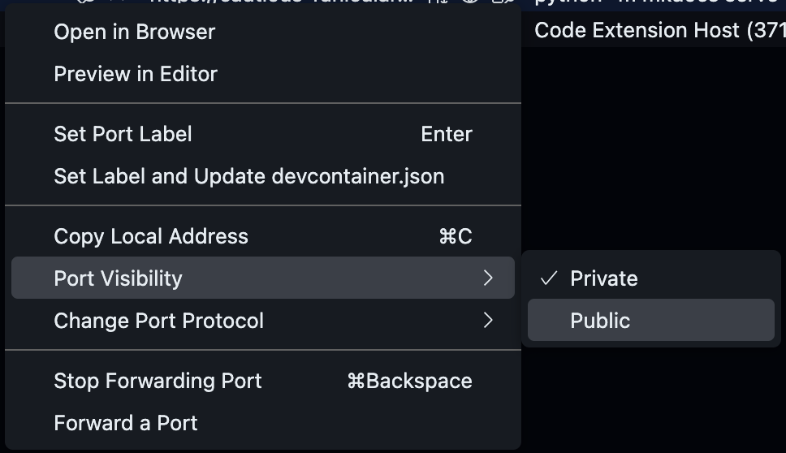
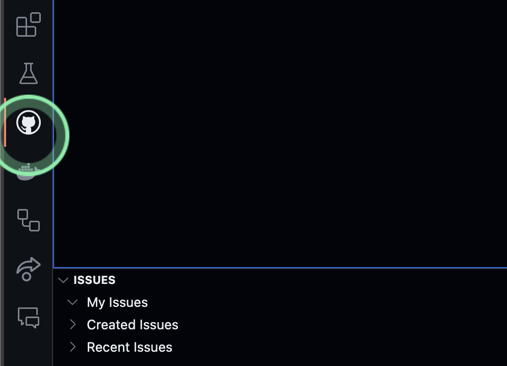
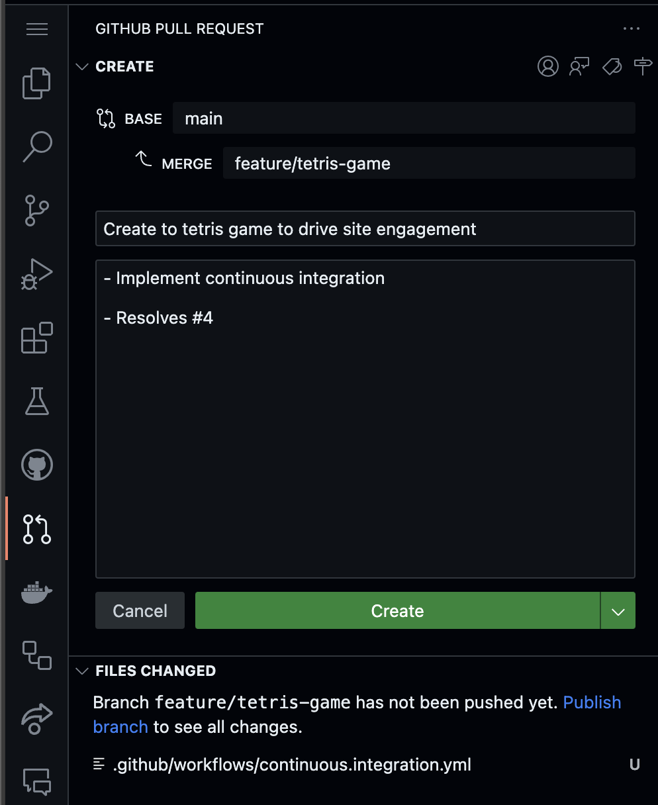
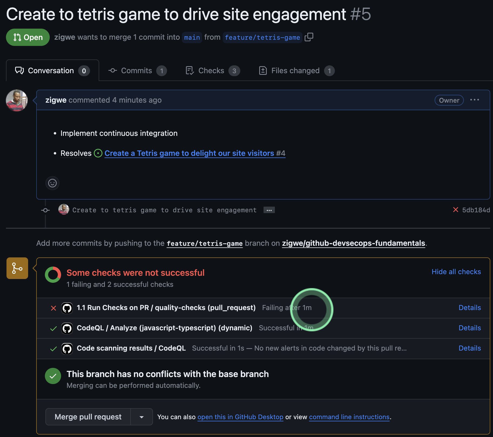
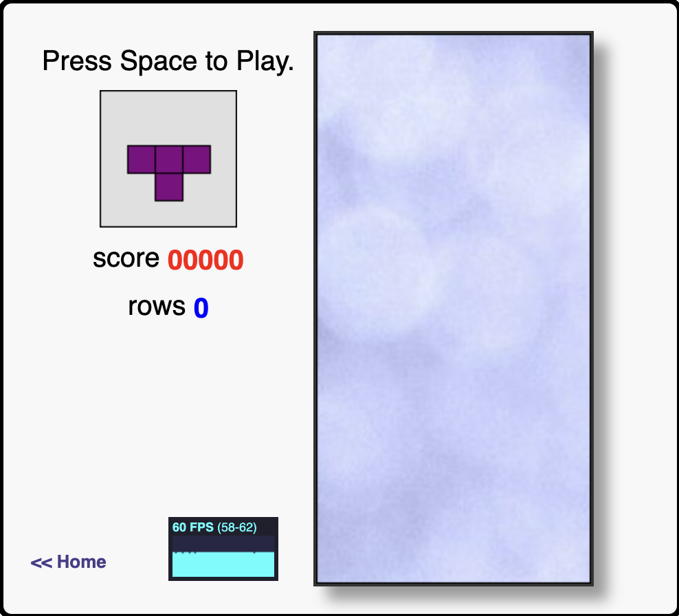
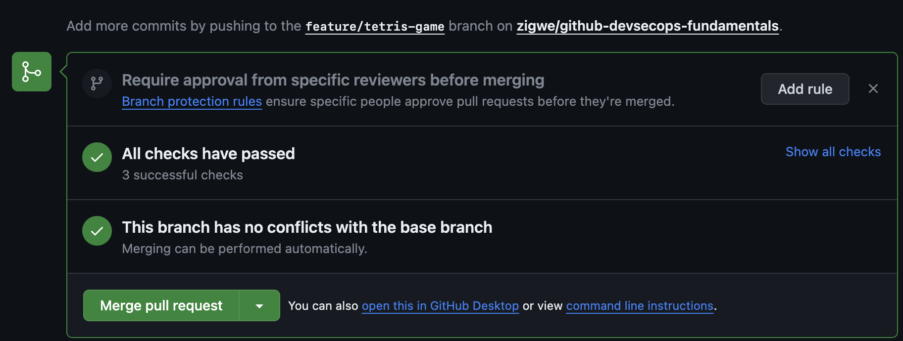

# :test_tube: Implementar Recursos

<!-- markdownlint-disable MD033 MD046 MD005 -->

!!! quote ":octicons-milestone-16: Permitir integração rápida ao desenvolvimento do projeto"

    > _Nosso objetivo é criar um **Jogo de Tetris** para encantar os visitantes do nosso site, sem perder tempo com processos complexos de integração ao projeto nem complicações devido ao excesso de ferramentas._
    >
    > Atualmente, navegar para a página do **Jogo de Tetris** do site do workshop mostra que o _recurso_ está faltando. Vamos resolver esse problema neste exercício.
    >
    > 

    

---

## Exercício: Integrar o **Jogo de Tetris**

Consulte novamente o ambiente de desenvolvimento Codespaces criado no [pré-requisito para o workshop](../../prerequisites.md#provisionar-um-novo-ambiente-de-desenvolvimento-em-nuvem-para-o-workshop).(1)
{ .annotate }

1. **:octicons-info-16:{ style="color: pink" } Seu Codespace pode ter parado devido à inatividade.** Não se preocupe, é bastante fácil voltar aos trilhos...

      - _Se a aba do navegador com seu Codespace ainda estiver aberta e você puder encontrá-la_, clique em <span class="gh-button-green">Reiniciar codespace</span> para continuar.
        
      - Caso contrário, você pode encontrá-lo no novo repositório que você criou.
        

---

### **:material-numeric-1-circle: Explore seu Codespace**

---

#### Entenda seu Codespace

`.devcontainer/devcontainer.json` descreve o provisionamento do seu codespace. Algumas das entradas de configuração são explicadas abaixo, com anotações ao lado da respectiva entrada. Você pode aprender mais sobre a [Especificação de Contêiner de Desenvolvimento](https://containers.dev/implementors/spec/) quando for conveniente.

```json title=".devcontainer/devcontainer.json" linenums="1" hl_lines="11"
{
  "hostRequirements": {//(1)!
    "cpus": 4,
    "memory": "16gb",
    "storage": "32gb"
  },
  "build": {
    "dockerfile": "./Dockerfile",//(2)!
    "context": ".."
  },
  "postAttachCommand": "python -m mkdocs serve --clean --dev-addr 127.0.0.1:8080",//(3)!
  "forwardPorts": [
    8080
  ],
  "containerEnv": {
    "TETRIS_APP_HOST": "127.0.0.1",
    "TETRIS_APP_PORT": "8080",
    "TETRIS_APP_PATH": "github-devsecops-fundamentals"
  },
  ...
```

1. Você pode personalizar o recurso de computação a ser disponibilizado para o ambiente Codespace, para adequar ao seu projeto.
2. Um `Dockerfile` pode ser usado para personalizar a imagem do contêiner do Codespace, por exemplo, você pode optar por pré-instalar consistentemente as dependências necessárias para o ambiente de desenvolvimento.
3. Tarefas podem ser configuradas para serem executadas no início de cada sessão de desenvolvimento, por exemplo, executar um servidor de desenvolvimento.

{==

Na visualização do **`TERMINAL`** na parte inferior, observe que um servidor de site local já está em execução. **Isso é resultado da entrada de configuração `postAttachCommand` no arquivo `.devcontainer/devcontainer.json`**.

Observando o log de compilação no terminal, você pode ver um aviso como o do exemplo a seguir.(1)
{ .annotate }

1. 💡 O aviso dá uma pista para resolver o problema de integração do Jogo de Tetris. Implementaremos a correção nas etapas posteriores!



:fire: A entrada de `INFO` no log que diz **`INFO    -  [05:36:30] Watching paths for changes: 'docs', 'mkdocs.yml'`** informa que o site local será reconstruído sempre que houver uma mudança na pasta `docs`.

==}

---

#### Habilitar Feedback Rápido de Colaboração

Mude para a visualização **`PORTS`** no painel inferior, observe que há uma entrada **`Site (8080)`** na tabela.

1. Foque seu ponteiro do mouse :fontawesome-solid-hand-pointer: em **`Site (8080)`** para revelar contextos adicionais.
1. Clique no ícone **:material-file-search-outline: Preview in editor** para navegar na compilação local do site dentro do navegador do editor.(1)
    { .annotate }

    1. - :warning: **Apenas você tem acesso ao site publicado no momento.**
       - :bulb: Você também pode clicar no ícone **:octicons-globe-16:** associado à entrada **`Site (8080)`** para ver o site em seu navegador normal.

**Abra acesso a outras partes interessadas para colaboração.**

1. Clique com o botão direito na entrada **`Site (8080)`**
1. No menu pop-up, coloque o ponteiro do mouse no item **Port Visibility** e selecione a opção **Public**.
    { style="width: 40em" }

{==

:octicons-goal-16:{ style="color: pink" } Agora, outras partes interessadas com quem você compartilhar a URL do site podem acessá-lo. **Consequentemente, elas também podem avaliar seu trabalho em andamento e colaborar com feedbacks oportunos.**

==}

---

### **:material-numeric-2-circle: Implementar Verificações Automatizadas**

O GitHub como plataforma é orientado a eventos. Além do comum, você pode geralmente automatizar seus processos de negócios reais modelando atividades para produzir mudanças no GitHub, assim acionando a execução de certas tarefas automatizadas dependendo da natureza de uma mudança. Se você já está familiarizado com o conceito de [GitOps](https://www.gitops.tech/), pense em como a ideia pode ser estendida além dos escopos de provisionar infraestrutura e implementar implantação contínua.

Nesta fase fundamental de introdução ao DevSecOps, vamos focar nosso uso do poderoso sistema de eventos do GitHub para conduzir verificações e testes de {== **integração contínua** ==} com os Workflows do GitHub.

---

#### Aprenda sobre GitHub Actions

!!! info "O que é GitHub Actions?"

    GitHub Actions é uma plataforma de integração contínua e entrega contínua (CI/CD) que permite automatizar seu pipeline de compilação, teste e implantação. Você pode criar fluxos de trabalho que compilam e testam cada pull request para seu repositório, ou implantam pull requests mesclados para produção.

    GitHub Actions vai além do DevOps e permite que você execute fluxos de trabalho quando outros eventos acontecem em seu repositório. Por exemplo, você pode executar um fluxo de trabalho para adicionar automaticamente as etiquetas apropriadas sempre que alguém cria um novo problema em seu repositório.

    GitHub fornece máquinas virtuais Linux, Windows e macOS para executar seus fluxos de trabalho, ou você pode hospedar seus próprios executores auto-hospedados em seu próprio data center ou infraestrutura de nuvem.

    ~ [Entendendo GitHub Actions](https://docs.github.com/pt/actions/learn-github-actions/understanding-github-actions)

```yaml title="Anatomia de um Workflow GitHub"
name: Aprenda GitHub Actions #(1)!

run-name: ${{ github.actor }} está aprendendo GitHub Actions #(2)!

on: [push] #(3)!

permissions: #(12)!
    contents: read

env: #(13)!
    LEARNER_NAME: Igwe

jobs: #(4)!

    check-bats-version: #(5)!

        runs-on: ubuntu-latest #(6)!

        steps: #(7)!

            - uses: actions/checkout@v4 #(8)!

            - uses: actions/setup-node@v4 #(9)!
              with:
                  node-version: '14'

            - run: npm install -g bats #(10)!

            - run: bats -v #(11)!

            - run: echo "Ei ${LEARNER_NAME}, você está indo bem... Você dominou o GitHub Actions\!"
```

1. `Opcional` - O nome do fluxo de trabalho como aparecerá na aba "Actions" do repositório do GitHub. Se este campo for omitido, o nome do arquivo do fluxo de trabalho será usado.
2. `Opcional` - O nome para execuções de fluxo de trabalho geradas a partir do fluxo de trabalho, que aparecerá na lista de execuções de fluxo de trabalho na aba "Actions" do seu repositório. Este exemplo usa uma expressão com o contexto `github` para exibir o nome de usuário do ator que acionou a execução do fluxo de trabalho. Para mais informações, veja "[Sintaxe de fluxo de trabalho para GitHub Actions](https://docs.github.com/pt/actions/using-workflows/workflow-syntax-for-github-actions#run-name)."
3. Especifica o gatilho para este fluxo de trabalho. Este exemplo usa o evento `push`, então uma execução de fluxo de trabalho é acionada sempre que alguém envia uma alteração para o repositório ou mescla um pull request. Isso é acionado por um push para qualquer branch; para exemplos de sintaxe que são executados apenas em pushes para branches, caminhos ou tags específicos, veja "[Sintaxe de fluxo de trabalho para GitHub Actions](https://docs.github.com/pt/actions/reference/workflow-syntax-for-github-actions#onpushpull_requestpull_request_targetpathspaths-ignore)" e {== "[Eventos que acionam fluxos de trabalho](https://docs.github.com/pt/actions/using-workflows/events-that-trigger-workflows)" ==}.
4. Agrupa todos os trabalhos que são executados no fluxo de trabalho `learn-github-actions`.
5. Define um trabalho chamado `check-bats-version`. As chaves filho definirão propriedades do trabalho.
6. Configura o trabalho para ser executado na versão mais recente de um executor Linux Ubuntu. Isso significa que o trabalho será executado em uma máquina virtual nova hospedada pelo GitHub. Para exemplos de sintaxe usando outros executores, veja "[Sintaxe de fluxo de trabalho para GitHub Actions](https://docs.github.com/pt/actions/reference/workflow-syntax-for-github-actions#jobsjob_idruns-on)"
7. Agrupa todos os passos que são executados no trabalho `check-bats-version`. Cada item aninhado sob esta seção é uma ação ou script de shell separado.
8. A palavra-chave `uses` especifica que este passo executará a ação `actions/checkout` na versão `v4`. Esta é uma ação que verifica seu repositório no executor, permitindo que você execute scripts ou outras ações contra seu código (como ferramentas de compilação e teste). Você deve usar a ação de checkout sempre que seu fluxo de trabalho usar o código do repositório.

    !!! info ""

        Ações são os blocos de construção que impulsionam seu fluxo de trabalho. Um fluxo de trabalho pode conter ações criadas pela comunidade, ou você pode criar suas próprias ações diretamente no repositório da sua aplicação.

        Para saber mais, consulte:

        - [Encontrando e personalizando ações](https://docs.github.com/pt/actions/learn-github-actions/finding-and-customizing-actions)
        - [Sobre ações personalizadas](https://docs.github.com/pt/actions/creating-actions/about-custom-actions)

9. Este passo usa a ação `@v3` para instalar a versão especificada do Node.js. (Este exemplo usa a versão 14.) Isso coloca os comandos `node` e `npm` em seu `PATH`.
10. A palavra-chave `run` diz ao trabalho para executar um comando no executor. Neste caso, você está usando `npm` para instalar o pacote de teste de software `bats`.
11. Finalmente, você executará o comando `bats` com um parâmetro que exibe a versão do software.
12. No início de cada trabalho do fluxo de trabalho, o GitHub cria automaticamente um segredo único `GITHUB_TOKEN` para uso em seu fluxo de trabalho. Você pode usar o `GITHUB_TOKEN` para se autenticar no trabalho do fluxo de trabalho.

    Quando você habilita o GitHub Actions, o GitHub instala um aplicativo GitHub em seu repositório. O segredo `GITHUB_TOKEN` é um token de acesso de instalação do aplicativo GitHub. Você pode usar o token de acesso de instalação para autenticar em nome do aplicativo GitHub instalado em seu repositório. As permissões do token são limitadas ao repositório que contém seu fluxo de trabalho.

    {==

    **Você pode modificar as permissões para o `GITHUB_TOKEN` em arquivos de fluxo de trabalho individuais. Se as permissões padrão para o `GITHUB_TOKEN` forem restritivas, você pode ter que elevar as permissões para permitir que algumas ações e comandos sejam executados com sucesso. Se as permissões padrão forem permissivas, você pode editar o arquivo de fluxo de trabalho para remover algumas permissões do `GITHUB_TOKEN`. Como uma boa prática de segurança, você deve conceder ao `GITHUB_TOKEN` o menor acesso necessário.**

    ==}

    Saiba mais sobre as [Permissões padrão para o `GITHUB_TOKEN`](https://docs.github.com/pt/actions/security-guides/automatic-token-authentication).

13. Isso define um `mapa` de variáveis que estão disponíveis para os passos de todos os trabalhos no fluxo de trabalho. Você também pode definir variáveis que estão disponíveis apenas para os passos de um único trabalho ou para um único passo. Saiba mais em [Definindo variáveis de ambiente para um único fluxo de trabalho](https://docs.github.com/pt/actions/learn-github-actions/variables).

---

#### Implementar Verificações Automatizadas de Pull Request

!!! info "O que é um Pull Request (também conhecido como PR)?"

    Pull requests permitem que você informe outros sobre as mudanças que você enviou para um branch em um repositório no GitHub. Uma vez que um pull request é aberto, você pode discutir e revisar as potenciais mudanças com colaboradores e adicionar commits de acompanhamento antes que suas mudanças sejam mescladas no branch base.

    ~ [Sobre pull requests](https://docs.github.com/pt/pull-requests/collaborating-with-pull-requests/proposing-changes-to-your-work-with-pull-requests/about-pull-requests)

Para habilitar verificações de qualidade no projeto em alta velocidade, implemente um fluxo de trabalho que padronize verificações automatizadas da seguinte forma.

```yaml title=".github/workflows/continuous.integration.yml" linenums="1" hl_lines="3-6 43-45 47-48"
--8<-- "reference.implementations/workflows/1.1.continuous.integration.yml"
```

##### Análise

- **Linhas `3 - 6`**

    O fluxo de trabalho será acionado quando um pull request for criado direcionado ao branch `main`. Adicionalmente, alterações em um pull request farão com que o fluxo de trabalho seja executado novamente.

- **Linhas `43 - 45`**

    Primeira verificação: O site é compilado com a opção `--strict`, de modo que a ocorrência de qualquer `AVISO` resulte em uma verificação falha. Como está, podemos esperar que as verificações automatizadas sinalizem o pull request como não conforme nesta etapa.

- **Linhas `47 - 48`**

    Segunda verificação: Desde que a etapa de compilação tenha sido bem-sucedida, este próximo passo testa a corretude da implementação do recurso de acordo com as expectativas de valor do cliente. Até agora, não devemos chegar a este ponto na execução do fluxo de trabalho, pois a **`Compilação` deve ter falhado porque a implementação do recurso do jogo Tetris não foi concluída**.
    
---

#### Publicar suas alterações

!!! tip "Você pode vincular suas alterações a uma issue"

    Lembre-se da issue que você criou anteriormente e seu respectivo número, você o usará para vincular suas alterações atuais à issue.

1. Commit e push das alterações.

    ```bash linenums="1"
    git checkout -b feature/tetris-game
    git add .
    git commit -m "$(printf 'Criar um jogo de tetris para impulsionar o engajamento do site\n\n- Implementar integração contínua\n\n- Resolve #<NÚMERO-DA-ISSUE>')"
    git push -u origin feature/tetris-game
    ```

1. Crie um pull request clicando no ícone **GitHub** na barra lateral e depois clicando no ícone **Criar Pull Request**.

    1. { style="width: 15em" }

    1. { style="width: 25em" }

    Verifique se o branch local e o repositório de onde você está mesclando, e o branch remoto e o repositório para onde você está mesclando, estão corretos. **Você pode deixar o título e a descrição do pull request pré-preenchidos como estão**.

    { style="height: 25em" }

    Clique em "**Criar**", e se solicitado, clique em "**Sempre**" ou "**Publicar Branch**".

1. O pull request que você criou será listado em `https://github.com/<SEU-HANDLE>/github-devsecops-fundamentals/pulls`.

    {==

    Ao abrir o pull request para exploração, você deve observar o seguinte:

    - **:octicons-comment-discussion-16: Conversa**

        Particularmente permite e resume discussões/revisões sobre suas alterações com outros colaboradores e partes interessadas. E adicionalmente resume o resultado das verificações no pull request.
    - **:octicons-git-commit-16: Commits**

        Resume todos os commits que contribuem para o pull request.

    - **:octicons-checklist-16: Verificações**

        Lista as verificações executadas no pull request e seus respectivos resultados.

    - **:octicons-file-diff-16: Arquivos alterados**

        Mostra um `diff` de arquivos modificados e adicionados devido ao pull request.

    

    !!! note

        Observe as 3 verificações executadas.

        - 1 falha devido a erro na compilação do site.
        - 2 verificações de análise de código passaram.

    ==}

---

### **:material-numeric-3-circle: Implementar Mudanças de Recursos**

A etapa `Build` nas verificações automatizadas implementadas anteriormente deve identificar uma falha apontando finalmente para a incompletude do recurso esperado do jogo Tetris. Na fase atual, tomaremos medidas para integrar o jogo Tetris da seguinte forma.

1. Renomeie a pasta **`docs/.tetris.game`** para **`docs/tetris.game`**, ou seja, simplesmente remova o prefixo `.` do nome.
2. Encontre e abra o arquivo **`mkdocs.yml`** no Explorador de Arquivos (está na raiz da árvore de arquivos)

   - Confirme que a entrada relevante do `Tetris Game` aponta para um arquivo de índice na pasta `tetris.game`

     ```yaml linenums="152" hl_lines="20"
      nav:
        - Home: index.md
        - Prerequisites: prerequisites.md
        - Exercises:
            - Introduction: exercises/index.md
            - Collaborate:
                - exercises/01.collaborate/index.md
                - exercises/01.collaborate/01.md
                - exercises/01.collaborate/02.md
            - Secure the Software Supply Chain:
                - exercises/02.secure.the.software.supply.chain/index.md
                - exercises/02.secure.the.software.supply.chain/01.md
                - exercises/02.secure.the.software.supply.chain/02.md
            - Automate Release:
                - exercises/03.automate.release/index.md
                - exercises/03.automate.release/01.md
                - exercises/03.automate.release/02.md
            - ✨ Recap:
                - exercises/recap/index.md
        - Tetris Game: tetris.game/index.html
     ```

---

#### **Teste Manual**

1. Observe a compilação local no terminal, não deve haver nenhum :warning: `AVISO` no log.
1. Confirme manualmente que a integração do Jogo Tetris foi efetiva.
   

---

#### **Teste Automatizado**

Antes de publicar nossas novas alterações, implementaremos e executaremos um teste funcional para validar a implementação do recurso.

1. Abra o terminal e instale as dependências de teste.(1)
   { .annotate }

    1. 💡 Você pode criar uma sessão de terminal adicional clicando em :octicons-plus-16: no canto superior direito do painel **`TERMINAL`**.

    ```shell
    # Instalar Node.js
    nvm install --lts #(1)!
    # Instalar pacotes necessários para executar o teste funcional de UI
    npm install
    # Instalar o(s) navegador(es) contra o(s) qual(is) o teste funcional de UI deve ser executado
    npx playwright install --with-deps chromium #(2)!
    ```

       1. :octicons-info-16: Um ambiente codespace pode ser personalizado conforme necessário. Neste caso, personalizamos a sessão em execução instalando a versão mais recente do `Node.js`.
       2. :octicons-info-16: Este comando instala os navegadores necessários para o teste funcional. **Por favor, seja paciente, pode levar de 1 a 2 minutos para concluir a instalação.**

    Em seguida, implemente o teste funcional da seguinte forma.

    ```javascript title="tests/tetris.spec.js" linenums="1"
    --8<-- "reference.implementations/tests/tetris.spec.js"
    ```

    Finalmente, execute o teste automatizado.

    ```shell
    npx playwright test
    ```

    Quando tudo estiver feito corretamente, o teste deve passar.
    

1. Faça commit das alterações no branch atual `feature/tetris-game` e publique-o para revisão.

    !!! tip "Você pode vincular suas alterações a uma issue"

        Lembre-se da issue que você criou anteriormente e seu respectivo número, você o usará para vincular suas alterações atuais à issue.

    ```bash linenums="1"
    git add .
    git commit -m "$(printf 'Criar um jogo de tetris para impulsionar o engajamento do site\n\n-Integrar implementação do jogo Tetris\n\n- Resolve #<NÚMERO-DA-ISSUE>')"
    git push origin
    ```

    {==

    Observe que todas as verificações foram aprovadas.

    

    ==}

---

## 📚 Recursos

- [Criando um site do GitHub Pages](https://docs.github.com/pt/pages/getting-started-with-github-pages/creating-a-github-pages-site)
- [Introdução aos contêineres de desenvolvimento](https://docs.github.com/pt/codespaces/setting-up-your-project-for-codespaces/adding-a-dev-container-configuration/introduction-to-dev-containers)
- [Sintaxe de fluxo de trabalho para GitHub Actions](https://docs.github.com/pt/actions/using-workflows/workflow-syntax-for-github-actions#jobsjob_idenv)
- [Eventos que acionam fluxos de trabalho](https://docs.github.com/pt/actions/using-workflows/events-that-trigger-workflows)
- [Encontrando e personalizando ações](https://docs.github.com/pt/actions/learn-github-actions/finding-and-customizing-actions)
- [Análise de código](https://docs.github.com/pt/code-security/code-scanning)
- [Fortalecimento de segurança para GitHub Actions](https://docs.github.com/pt/actions/security-guides/security-hardening-for-github-actions)

---
