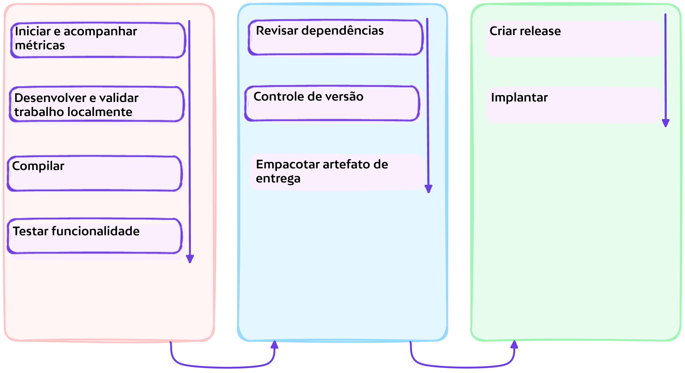

# :test_tube: Versionamento

<!-- markdownlint-disable MD046 -->

!!! quote ":octicons-milestone-16: Motivação para Versões"

    > Um pull request representa uma única agregação de múltiplas mudanças significativas (ou seja, commits). Ao colaborar em escala em uma equipe ou projeto grande, pull requests direcionados ao branch padrão (produção) podem ser ainda mais protegidos por uma fila de mesclagem para validação adicional. Em qualquer caso, é imperativo acompanhar as mudanças agregadas introduzidas no branch padrão, que serve como fonte básica para lançamentos de produção.
    >
    > Algumas versões podem eventualmente ser lançadas, enquanto outras não. Além disso, uma versão lançada pode ser revertida para um lançamento anterior conforme as decisões de negócios evoluem.

    

---

## Exercício: Versionar Mudanças Adicionadas ao Branch Principal

Versionamento Semântico, `semver`, é um esquema que transmite significado sobre o código subjacente e o que foi modificado de uma versão para a próxima.

A versão `2.0.0` do `semver` é oficialmente resumida da seguinte forma:

> Dado um número de versão MAJOR.MINOR.PATCH, incremente o:
>
> 1. Número de versão MAJOR quando fizer mudanças incompatíveis na API
> 1. Número de versão MINOR quando adicionar funcionalidades de maneira compatível com versões anteriores
> 1. Número de versão PATCH quando fizer correções de bugs compatíveis com versões anteriores
>
> Rótulos adicionais para pré-lançamento e metadados de compilação estão disponíveis como extensões ao formato MAJOR.MINOR.PATCH.

Nesta fase fundamental da implementação de DevSecOps, aplicaremos o esquema `semver` e automatizaremos o incremento do patch. Existem convenções que podem ser adotadas para automatizar igualmente o incremento nas versões `MAJOR` e `MINOR`, mas para simplificar, nossa implementação pretendida assume o entendimento de que os aumentos de versão `MAJOR` e `MINOR` serão iniciados manualmente.

---

### **:material-numeric-1-circle: Implementar Versionamento de `PATCH`**

No explorador de arquivos, crie um novo fluxo de trabalho `.github/workflows/continuous.versioning.yml` da seguinte forma:

```yaml title=".github/workflows/continuous.versioning.yml" linenums="1" hl_lines="4-6 13-17 25-31 33-47 49-60"
--8<-- "reference.implementations/workflows/2.1.continuous.delivery.yml"
```

---

#### Análise

- **Linhas `4 - 6`**

    Somos introduzidos a um novo evento que encapsula a atividade de envio para branches específicos, especificamente apenas o branch `main` nesta implementação.

- **Linhas `13 - 17`**

    Um GitHub App será usado como o ator para as operações que executaremos. Portanto, a ação `actions/create-github-app-token@v1` é usada aqui para gerar um token de autorização para o aplicativo.

    !!! question "O que é um GitHub App?"
        GitHub Apps, muito _semelhantes_ a `contas de serviço` e `bots`, são ferramentas que estendem a funcionalidade do GitHub. Você pode criar um GitHub App para fornecer flexibilidade e reduzir atrito em seus processos, {== sem precisar fazer login como usuário ou criar uma conta de serviço ==}. GitHub Apps podem fazer coisas no GitHub como abrir issues, comentar em pull requests e gerenciar projetos. Eles também podem fazer coisas fora do GitHub com base em eventos que acontecem no GitHub. Por exemplo, um GitHub App pode postar no Slack quando uma issue é aberta no GitHub.

    O ator GitHub App será usado posteriormente para fazer checkout do código-fonte do repositório e para enviar tags.

- **Linhas `25 - 31`**

    A etapa `Get last version number` (Obter último número de versão) calcula a última versão e a escreve na saída da etapa chamada `last_version`.

- **Linhas `33 - 47`**

    A etapa `Get new version number` (Obter novo número de versão) lê a saída da etapa anterior pela expressão `${{ steps.get_last_version.outputs.last_version }}` e a usa para calcular o incremento do patch.

- **Linhas `49 - 60`**

    A etapa `Create tag for the new version` (Criar tag para a nova versão) cria uma nova tag `git` para o lançamento. Uma tag identifica pontos específicos no histórico de um repositório como sendo importantes. Aqui, a tag está sendo usada para marcar um ponto de lançamento.

    Como existe um token de aplicativo persistente que será usado no envio da tag, podemos ter confiança de que o envio acionará efetivamente outras automações relevantes. Por outro lado, se o `GITHUB_TOKEN` padrão fosse usado, ele não acionaria um fluxo de trabalho, pois {== **GitHub Actions corretamente protege contra o acionamento recursivo não intencional de fluxos de trabalho** ==}.

---

### **:material-numeric-2-circle: Fazer commit e publicar suas alterações**

!!! tip "Você pode vincular suas alterações a uma issue"

    Lembre-se da issue que você criou anteriormente e seu respectivo número, você o usará para vincular suas alterações atuais à issue.

```bash linenums="1"
git add .
git commit -m "$(printf 'Criar um jogo de tetris para impulsionar o engajamento do site\n\n-Implementar versionamento automático de patch\n\n- Resolve #<NÚMERO-DA-ISSUE>')"
git push origin feature/tetris-game
```

---

## 📚 Recursos

- [Versionamento Semântico 2.0.0](https://semver.org/)

---
