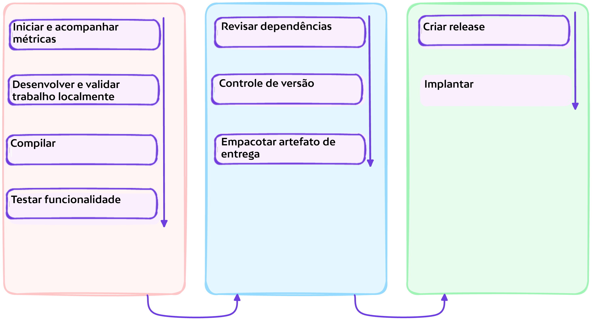

# :test_tube: Lançamento de Versão

<!-- markdownlint-disable MD046 -->

!!! quote ":octicons-milestone-16: Lançamento"

    > À medida que fluxos de mudanças chegam ao branch de _produção_ e são versionados em lotes, uma parte essencial da entrega/implantação contínua é produzir artefatos a partir de versões que podem então ser implantados em vários destinos.
    >
    > Lançamentos são iterações de software implantáveis que você pode empacotar e disponibilizar para um público mais amplo baixar e usar.
    >
    > Como determinamos quando criar um lançamento? Vamos ver...

    

---

## Exercício: Criar um Lançamento de Versões

Como você já pode imaginar, o GitHub fornece um evento que encapsula a atividade de criar uma tag e enviá-la para um repositório. Vamos automatizar o tratamento de tais eventos, para que possamos criar um lançamento quando necessário.

---

### **:material-numeric-1-circle: Implementar Criação de Lançamento**

No explorador de arquivos, crie um novo fluxo de trabalho `.github/workflows/continuous.delivery.yml` da seguinte forma:

```yaml title=".github/workflows/continuous.delivery.yml" linenums="1" hl_lines="3-6 29-34 39-43 45-70 72-81 83-105"
--8<-- "reference.implementations/workflows/2.2.continuous.delivery.yml"
```

---

#### Análise

- **Linhas `3 - 6`**

    O fluxo de trabalho de criação de lançamento será acionado por envios de tags e quando a versão da tag enviada tiver o sufixo de metadados `-release`.

- **Linhas `29 - 34`**

    Nos dois passos incluídos aqui, o site é compilado e arquivado como um artefato de lançamento.

- **Linhas `39 - 43`**

    Um GitHub App será usado como o ator para as operações que executaremos. Portanto, a ação `actions/create-github-app-token@v1` é usada aqui para gerar um token de autorização para o aplicativo.

    !!! question "O que é um GitHub App?"
        GitHub Apps, muito _semelhantes_ a `contas de serviço` e `bots`, são ferramentas que estendem a funcionalidade do GitHub. Você pode criar um GitHub App para fornecer flexibilidade e reduzir atrito em seus processos, {== sem precisar fazer login como usuário ou criar uma conta de serviço ==}. GitHub Apps podem fazer coisas no GitHub como abrir issues, comentar em pull requests e gerenciar projetos. Eles também podem fazer coisas fora do GitHub com base em eventos que acontecem no GitHub. Por exemplo, um GitHub App pode postar no Slack quando uma issue é aberta no GitHub.

    > _Quando você usa o `GITHUB_TOKEN` do repositório para executar tarefas, eventos acionados pelo `GITHUB_TOKEN`, com exceção de workflow_dispatch e repository_dispatch, não criarão uma nova execução de fluxo de trabalho. Isso evita que você crie acidentalmente execuções de fluxo de trabalho recursivas. Por exemplo, se uma execução de fluxo de trabalho envia código usando o `GITHUB_TOKEN` do repositório, um novo fluxo de trabalho não será executado mesmo quando o repositório contém um fluxo de trabalho configurado para ser executado quando ocorrerem eventos de push._
    >
    > ~ [Usando o GITHUB_TOKEN em um fluxo de trabalho](https://docs.github.com/pt/actions/security-guides/automatic-token-authentication#using-the-github_token-in-a-workflow)

    Portanto, estamos autorizando operações como um GitHub App para permitir que a execução da operação acione ainda mais execuções de fluxo de trabalho, possivelmente.

- **Linhas `45 - 70`**

    Um lançamento `rascunho` é criado pela respectiva etapa, permitindo a modificação do lançamento antes de publicá-lo. O lançamento faz referência à tag que acionou o fluxo de trabalho.

- **Linhas `72 - 81`**

    Esta etapa aproveita a API ReST do GitHub para ajustar o rascunho de lançamento criado anteriormente, especificamente adicionando o arquivo arquivado criado na etapa `Archive Site` ao lançamento como um ativo.

- **Linhas `83 - 105`**

    Tendo rascunhado o lançamento e anexado ativos implantáveis a ele, a etapa `Publish release` finalmente publica o lançamento alterando o estado do atributo `draft` para `false`.

---

### **:material-numeric-2-circle: Fazer commit e publicar suas alterações**

!!! tip "Você pode vincular suas alterações a uma issue"

    Lembre-se da issue que você criou anteriormente e seu respectivo número, você o usará para vincular suas alterações atuais à issue.

```bash linenums="1"
git add .
git commit -m "$(printf 'Criar um jogo de tetris para impulsionar o engajamento do site\n\n-Implementar automação de lançamento\n\n- Resolve #<NÚMERO-DA-ISSUE>')"
git push origin feature/tetris-game
```

---

## 📚 Recursos

- [Documentação do GitHub Apps](https://docs.github.com/pt/apps)
- [Documentação da API REST do GitHub](https://docs.github.com/pt/rest?apiVersion=2022-11-28)
- [GitHub Packages](https://docs.github.com/pt/packages/guides/about-github-container-registry)

---
