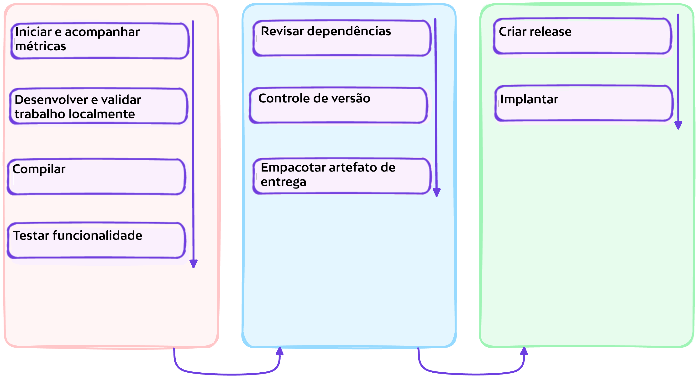
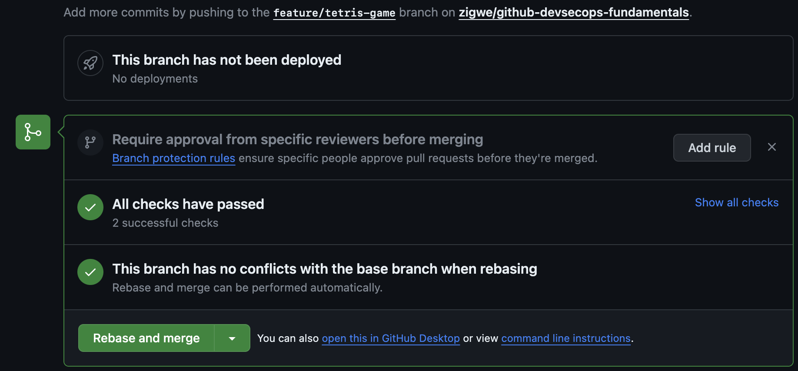
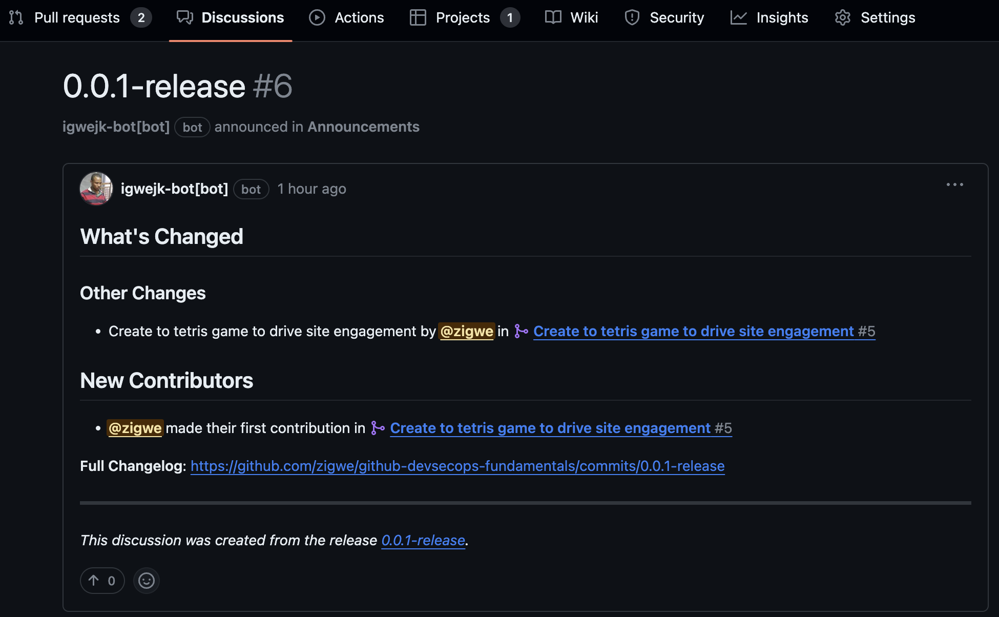
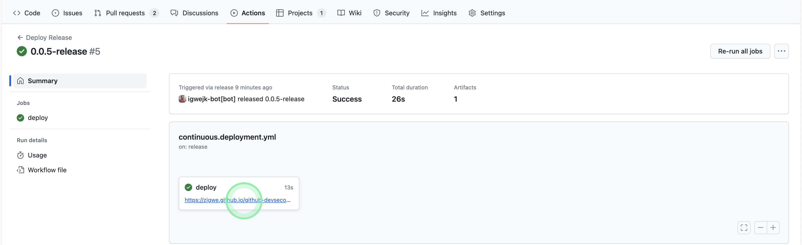
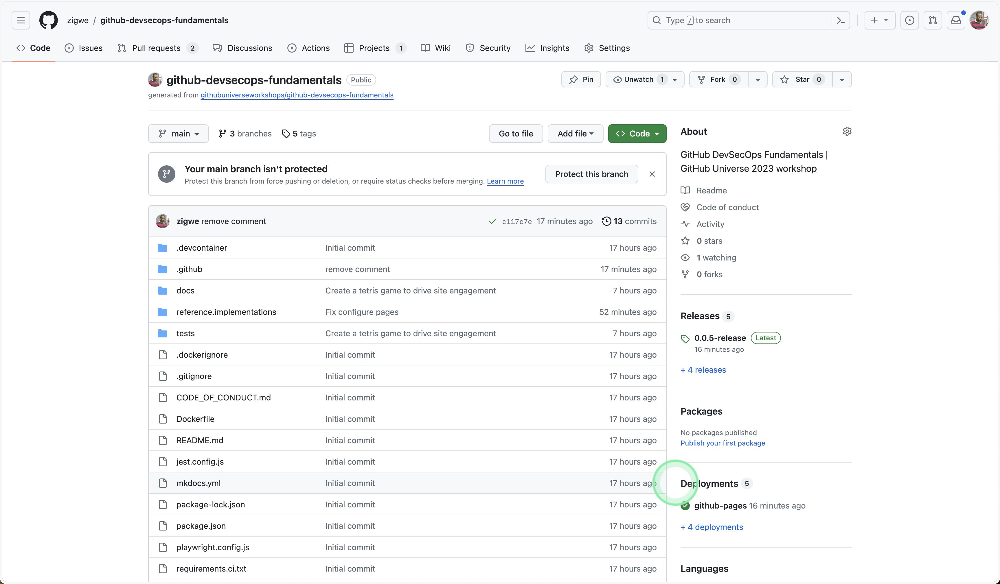
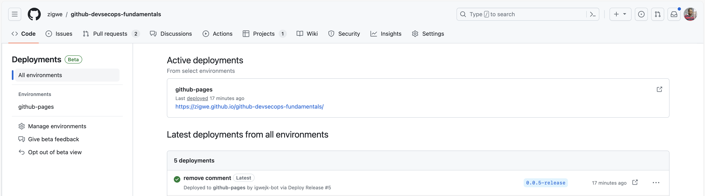

# :test_tube: Implantação Contínua

<!-- markdownlint-disable MD033 MD036 MD046 -->

!!! quote ":octicons-milestone-16: Entregar valor de alta qualidade com velocidade"

    > Implantação contínua (CD) é a prática de usar automação para publicar e implantar atualizações de software.
    >
    > Para cumprir plenamente nosso objetivo no desenvolvimento completo do recurso, aplicamos em conjunto a prática de implantação contínua para validar e entregar valor aos nossos clientes com alta velocidade.

    

---

## Exercício: Automatizar Implantação de Lançamentos

O exercício anterior nos guiou através da automação da publicação de lançamentos. Vamos continuar a construir sobre esse marco para automatizar a implantação dos lançamentos publicados.

---

### **:material-numeric-1-circle: Implementar Fluxo de Trabalho de Implantação**

No explorador de arquivos, crie um novo fluxo de trabalho `.github/workflows/continuous.deployment.yml` da seguinte forma:

```yaml title=".github/workflows/continuous.deployment.yml" linenums="1" hl_lines="3-6 8-10 25-27 36-40 42-65 67-71 73-77"
--8<-- "reference.implementations/workflows/3.continuous.deployment.yml"
```

---

#### Análise

- **Linhas `3 - 6`**

    As implantações serão acionadas no evento de uma publicação de lançamento.

- **Linhas `8 - 10`**

    Garante que apenas um único trabalho ou fluxo de trabalho usando o mesmo grupo de concorrência será executado por vez.

    Quando um trabalho ou fluxo de trabalho concorrente é enfileirado, se outro trabalho ou fluxo de trabalho que usa o mesmo grupo de concorrência no repositório estiver em andamento, o trabalho ou fluxo de trabalho enfileirado ficará pendente. Qualquer trabalho ou fluxo de trabalho anteriormente pendente no grupo de concorrência será cancelado. Se você não deseja cancelar também nenhum trabalho ou fluxo de trabalho em execução no mesmo grupo de concorrência, especifique `cancel-in-progress: false`.

- **Linhas `25 - 27`**

    Isso fará com que a URL do site implantado seja exibida onde o fluxo de trabalho é executado.

- **Linhas `36 - 40`**

    Esta etapa habilita o [GitHub Pages](https://docs.github.com/pt/pages/getting-started-with-github-pages/about-github-pages) e extrai vários metadados sobre um site. Ela também pode ser usada para configurar vários geradores de sites estáticos que suportamos como fluxos de trabalho iniciais.

- **Linhas `42 - 65`**

    Baixa os ativos associados à publicação de lançamento que acionou este fluxo de trabalho e, quando necessário, ajusta as permissões para os arquivos nos ativos.

- **Linhas `67 - 71`**

    Carrega os artefatos do site para o local de armazenamento onde devem ser finalmente coletados pela próxima etapa para implantação.

- **Linhas `73 - 77`**

    Esta etapa implanta o site.

---

### **:material-numeric-2-circle: Fazer commit e publicar suas alterações**

!!! tip "Você pode vincular suas alterações a uma issue"

    Lembre-se da issue que você criou anteriormente e seu respectivo número, você o usará para vincular suas alterações atuais à issue.

```bash linenums="1"
git add .
git commit -m "$(printf 'Criar um jogo de tetris para impulsionar o engajamento do site\n\n-Implementar implantação contínua\n\n- Resolve #<NÚMERO-DA-ISSUE>')"
git push origin feature/tetris-game
```

---

### **:material-numeric-3-circle: Mesclar seu pull request aberto**

- Na página do pull request, abra o menu suspenso do botão <span class="gh-button-green">Mesclar pull request <span class="gh-button-green-with-dropdown">:material-menu-down:</span></span> para escolher a opção **Rebase e mesclar**.

- Em seguida, pressione o botão <span class="gh-button-green">Rebase e mesclar <span class="gh-button-green-with-dropdown">:material-menu-down:</span></span> para mesclar seu pull request.

    { style="width: 25em;" }

- Finalmente, pressione <span class="gh-button-green">Confirmar rebase e mesclagem</span>.

Quando você mescla o pull request aberto, deve fazer as seguintes observações.

{==

**Colaboração**

- A issue vinculada em seu quadro de projeto é automaticamente fechada e movida para a coluna **✅ Concluído** do quadro.

    { style="width: 25em;" }

**Automação**

Quando você vai para a aba **:octicons-play-16: Actions** em seu repositório, e observa...

- O fluxo de trabalho `Version Changes to the Main Branch` é executado.
- O fluxo de trabalho `Package Delivery Artifacts & Create Release` é executado.

    Consequentemente, o lançamento é anunciado em **:octicons-comment-discussion-16: Discussões**.
    { style="width: 25em;" }

- O fluxo de trabalho `Deploy Release` é executado.

    E na conclusão bem-sucedida do fluxo de trabalho, a URL pública do seu site é exibida no trabalho.

    { style="width: 25em;" }

**Capacitação de Partes Interessadas**

As partes interessadas podem facilmente explorar implantações do projeto.

- Resumo de implantações na página inicial do repositório.

    { style="width: 25em;" }

- Lista detalhada de ambientes de implantação.

    { style="width: 25em;" }

==}

---

## 📚 Recursos

- [Usando ambientes para implantação](https://docs.github.com/pt/actions/deployment/targeting-different-environments/using-environments-for-deployment)
- [Criando regras de proteção de implantação personalizadas](https://docs.github.com/pt/actions/deployment/protecting-deployments/creating-custom-deployment-protection-rules)
- [Fortalecimento de segurança de implantações com OpenID Connect](https://docs.github.com/pt/actions/deployment/security-hardening-your-deployments/about-security-hardening-with-openid-connect)

---
