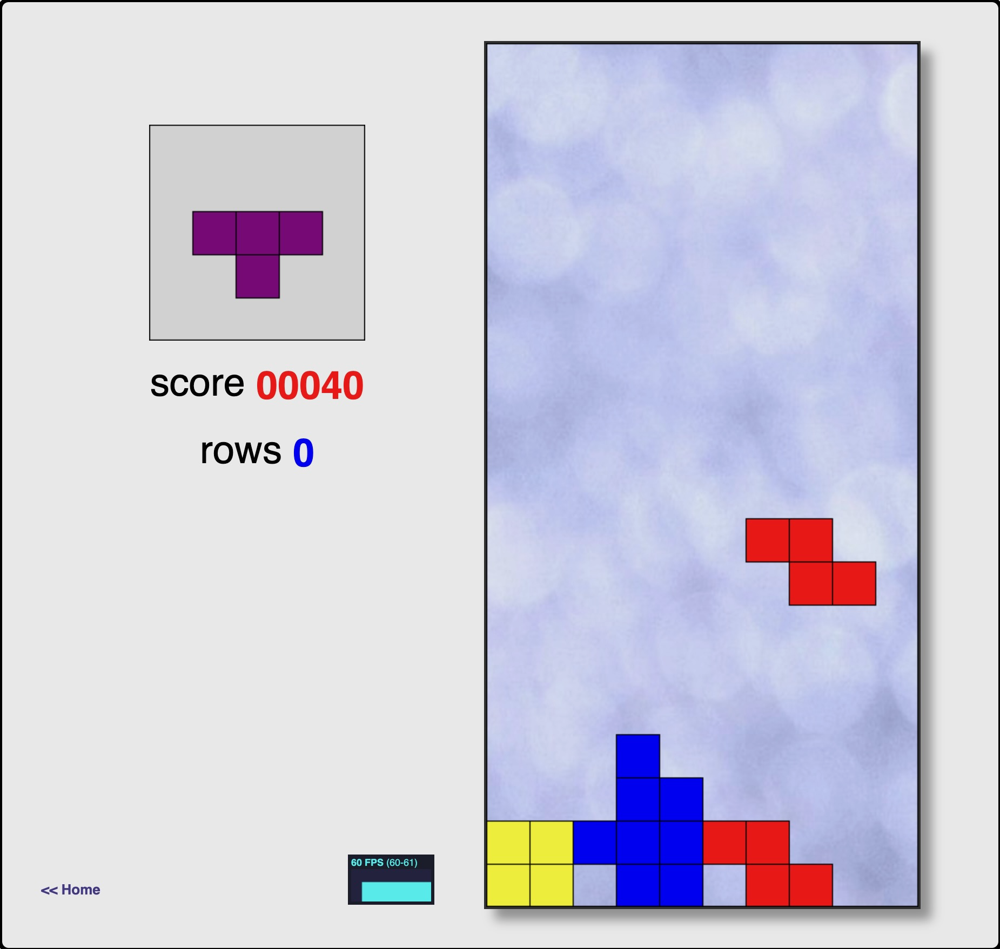
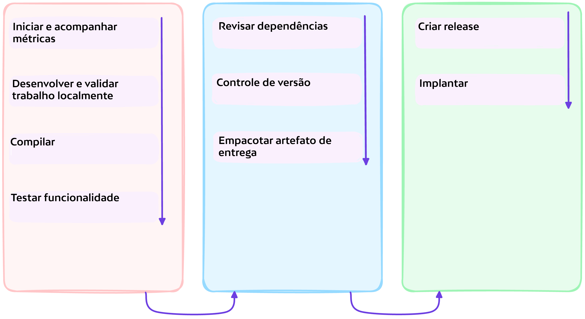

# :fontawesome-solid-flask-vial: Introdução

!!! quote ":octicons-milestone-16: Exercícios do Workshop"

    Os exercícios do workshop fornecem orientações para implementar o DevSecOps em nível fundamental com a plataforma GitHub. Ao concluir, você terá adquirido a experiência para implementar facilmente as capacidades do DevSecOps, como:

    - [x] Colaboração contínua
    - [x] Planejamento contínuo
    - [x] Integração contínua
    - [x] Entrega contínua
    - [x] Qualidade contínua
    - [x] Segurança contínua

    Este site do workshop também serve como o ***produto*** que visaremos para desenvolvimento. Durante os exercícios, você descobrirá como pode construir e testar o site localmente de forma rápida e implementar testes padronizados para permitir verificações de qualidade automatizadas no site.

---

## **:material-numeric-1-circle: Cenário do Workshop**

Você está trabalhando em uma equipe que é proprietária **_deste_** site, e um novo objetivo de negócio surgiu na visão da sua organização. Para aumentar o engajamento com o site...

> _...o objetivo é criar um **Jogo de Tetris** para encantar os visitantes do nosso site._

---

## **:material-numeric-2-circle: Marcos**

Os objetivos do workshop serão entregues através da conclusão dos seguintes marcos

- [x] Colaborar

      Facilitar a integração no projeto do site e permitir o desenvolvimento do projeto em alta velocidade para partes interessadas com diferentes níveis de experiência com o projeto.

- [x] Proteger a cadeia de suprimentos de software

      Implementar facilmente a segurança da aplicação e proteger a cadeia de suprimentos de software.

- [x] Automatizar a Implantação de Lançamentos

      Entregar valor ao usuário final de forma confiável e em alta velocidade.
