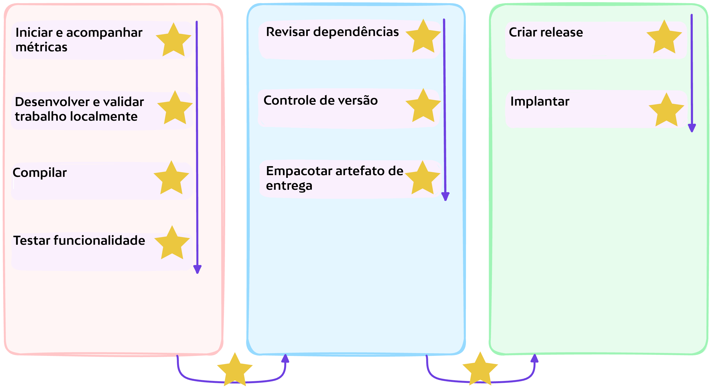

# :test_tube: Revisão dos Resultados do Workshop

Até agora, alcançamos os seguintes marcos, aprendendo a:

- [x] Rastrear trabalho no GitHub
- [x] Integrar-se rapidamente a um projeto existente
- [x] Trabalhar de maneira colaborativa e permitir a incorporação rápida de feedbacks
- [x] Proteger eficientemente a cadeia de suprimentos de software, detectando vulnerabilidades e dependências não conformes à medida que são introduzidas
- [x] Automatizar o versionamento
- [x] Automatizar lançamentos
- [x] Implementar implantação contínua
