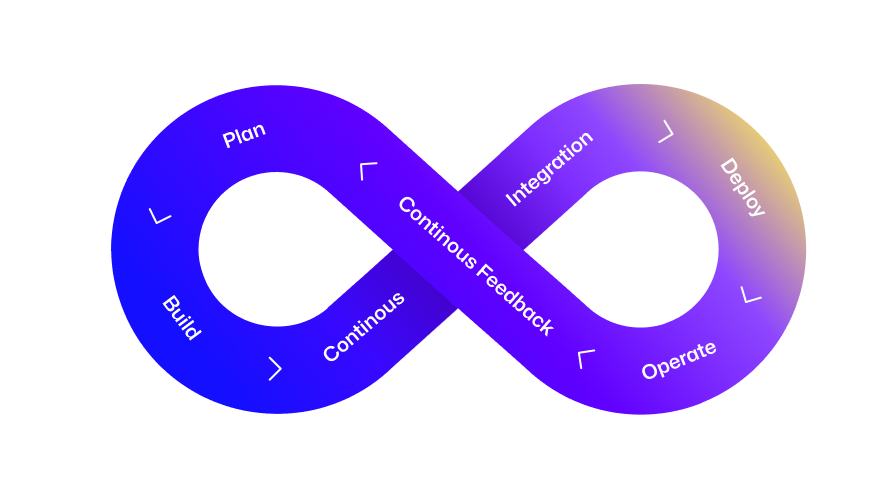

# :octicons-mark-github-16: GitHub DevSecOps Fundamentos | Workshop

<!-- markdownlint-disable MD033 -->

Este workshop autoguiado permitirá que você adquira as capacidades necessárias para implementar uma mentalidade DevSecOps, aproveitando a plataforma GitHub para uma experiência de desenvolvedor sem complicações.

<figure markdown style="background-color: #777; padding: 1em; border-radius: 0.25em; color: var(--md-primary-fg-color);">
{ loading=lazy }
<figcaption style="font-weight: bold; font-style: normal;">Plataforma GitHub</figcaption>
</figure>

!!! quote ""

    ## :octicons-goal-16:{ style="color: pink" } Objetivos de Aprendizagem

    - [x] Colaborar de forma eficaz para alta produtividade
    - [x] Aplicar segurança preventiva em todos os aspectos do processo de desenvolvimento
    - [x] Implementar uma cadeia de suprimentos de software segura
    - [x] Automatizar o lançamento de produtos e processos de negócios em geral
    - [x] Eliminar complicações devido ao excesso de ferramentas

     
    [:material-cursor-default-click: Complete a lista de verificação de **:footprints: Pré-requisitos**!](./prerequisites.md){ .md-button .md-button--primary }

    ## 📚 Recursos

    !!! quote inline end "Obtenha facilitação especializada do workshop..."

        Este workshop disponível publicamente é limitado para permitir que você aprenda com a pesquisa que o acompanha. Ele não aborda conceitos em escala empresarial.

        Entre em contato 📧 services@github.com para se beneficiar mais de uma facilitação de workshop pelos [**serviços especializados**](https://github.com/services/) do GitHub para apoiar o avanço da implementação de DevSecOps na sua organização.

    - [Planejamento de projetos para desenvolvedores](https://github.com/features/issues)
    - [Comece a programar instantaneamente com Codespaces](https://github.com/features/codespaces)
    - [Automatize seu fluxo de trabalho da ideia à produção](https://github.com/features/actions)
    - [Segurança em cada etapa](https://github.com/features/security)
    - [Seus pacotes, em casa com seu código](https://github.com/features/packages)
