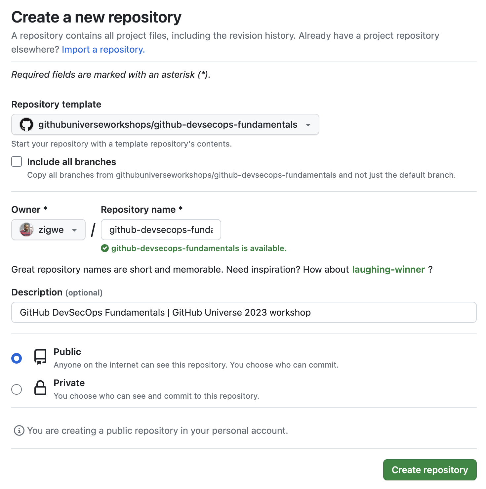
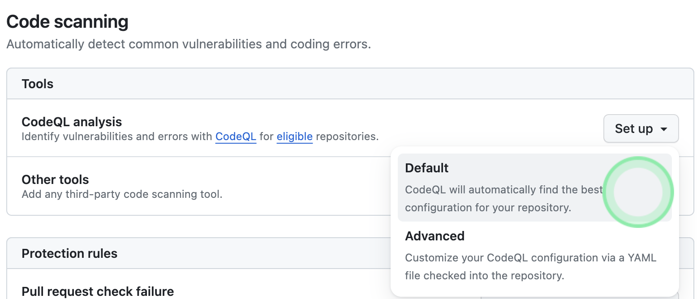
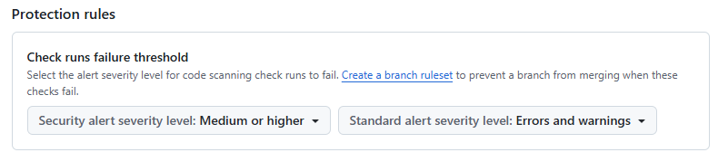
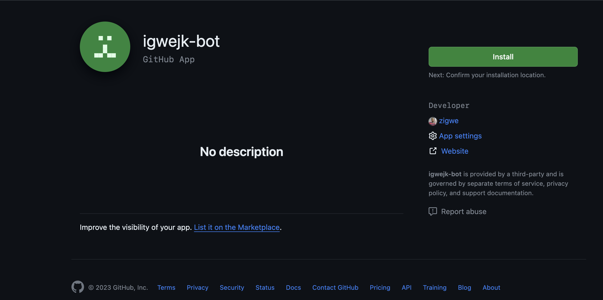
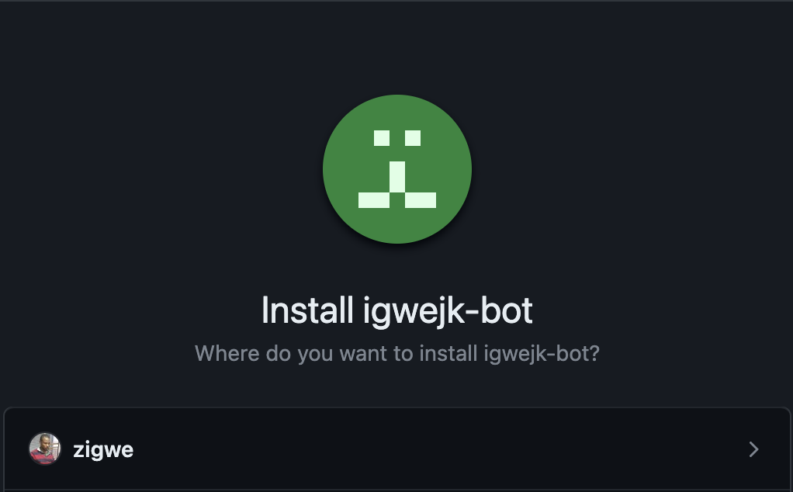
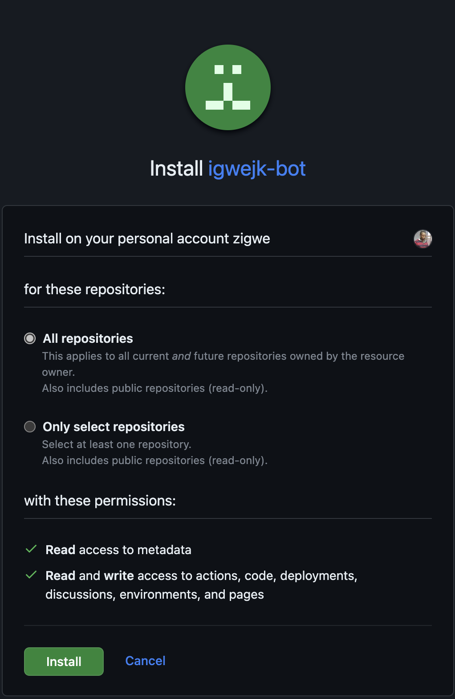
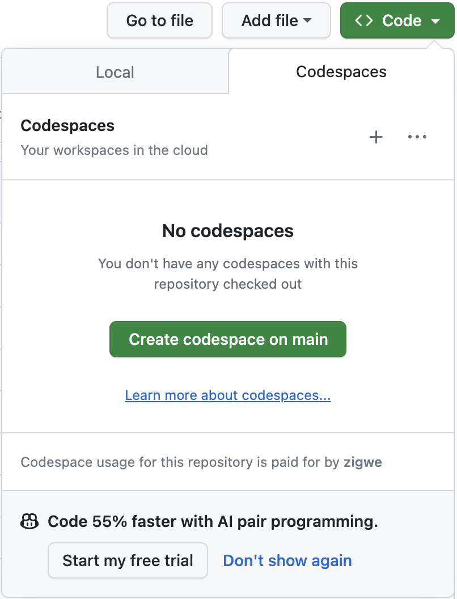

# :footprints: Pré-requisitos

<!-- markdownlint-disable MD033 -->

!!! tip "Prepare-se antes do workshop"

    Para garantir uma experiência sem problemas no workshop, complete os itens da lista de verificação na ordem.

## :material-numeric-1-circle: :fontawesome-brands-github-alt:{ .lg .middle } **Configure uma conta GitHub**

Faça login na sua conta GitHub.

Você pode criar uma nova conta GitHub, se ainda não tiver uma. (1)
{ .annotate }

1. :bulb: Clicar no botão abaixo abrirá a página em uma nova aba, para você criar uma nova conta GitHub. Mantenha seu **`@handle`** (nome de usuário) à mão depois de fazer login.

[:material-cursor-default-click: Criar uma nova conta GitHub](https://github.com/signup){.md-button target="\_blank"}

<br />

---

## :material-numeric-2-circle: :material-source-repository-multiple:{ .lg .middle } **Clone o projeto do workshop para sua própria conta**

1. [:material-cursor-default-click: Criar projeto do workshop](https://github.com/new?template_owner=dev-pods&template_name=devsecops-fundamentals&owner=%40me&name=github-devsecops-fundamentals&description=GitHub+DevSecOps+Fundamentals&visibility=public){.md-button target="\_blank"}
1. Na nova aba, a maioria dos campos será preenchida automaticamente e as configurações padrão devem estar corretas. Caso contrário...

      - Para proprietário, escolha sua conta pessoal.
      - Recomendamos criar um repositório público. (1)
        { .annotate }

        1. :bulb: Repositórios públicos se beneficiam de

            - [Uso gratuito dos minutos do GitHub Actions](https://docs.github.com/pt/billing/managing-billing-for-github-actions/about-billing-for-github-actions).
            - [Uso gratuito dos recursos do GitHub Advanced Security](https://docs.github.com/pt/get-started/learning-about-github/about-github-advanced-security#about-advanced-security-features).

      - Role para baixo e clique no botão <span class="gh-button-green">Create repository</span> na parte inferior do formulário.

        ??? info "Expanda para visualizar exemplo..."

            

1. Depois que a criação do seu novo repositório começar, aguarde cerca de 20 segundos e depois atualize a página.

<br />

---

## :material-numeric-3-circle: :octicons-feed-discussion-16: **Habilitar Discussões**

1. No GitHub.com, navegue até a página principal do seu novo repositório.
1. Abaixo do nome do repositório, clique em :octicons-gear-16: **Settings**.
    
1. Role para baixo até a seção "Set up discussions" e clique em <span class="gh-button-green">Set up Discussions</span>

<br />

---

## :material-numeric-4-circle: :material-security:{ .lg .middle } **Configurar segurança básica**

1. Navegue até a aba :octicons-gear-16: **Configurações** no seu novo repositório do workshop.
1. Na seção "**Segurança**" do menu, selecione :octicons-codescan-16: **Advanced Security**. Em seguida, configure as configurações para corresponder conforme a seguir (clicando em <span class="gh-repo-settings-button">Enable</span> onde a opção estiver/se tornar disponível).

    !!! note "Guia para configurações adicionais..."

        - **Atualizações de versão do Dependabot**

              Ao habilitar, você será solicitado a editar o arquivo de configuração `.github/dependabot.yml`. Simplesmente **navegue de volta** no seu navegador ou clique em <span class="gh-button-grey">Cancelar alterações</span> para sair do prompt e continuar a configuração de segurança básica.
        - **Análise CodeQL**

              1. A partir de <span class="gh-button-grey">Configurar</span>, selecione a opção Padrão.
                  
              1. Deixe as configurações padrão no prompt que segue e simplesmente clique em <span class="gh-button-green">Habilitar CodeQL</span> para continuar.
        - **Regras de proteção**

              Selecione a configuração conforme mostrado abaixo.
              

<br />

---

## :material-numeric-5-circle: :octicons-dependabot-16:{ .lg .middle } **Registrar um aplicativo GitHub**

1. No canto superior direito de qualquer página no GitHub, clique na sua foto de perfil.
1. Navegue até as suas **:octicons-gear-16: Settings** da conta.
1. Na barra lateral esquerda, clique em **:octicons-code-16: Developer settings**.
1. Na barra lateral esquerda, clique em **:octicons-apps-16: GitHub Apps**
1. Clique em **Novo aplicativo GitHub**

    !!! note "Forneça os valores dos campos do formulário da seguinte forma"

        ```text
        GitHub App name..: <SEU-HANDLE>-bot

        Homepage URL......: https://github.com/<SEU-HANDLE>/github-devsecops-fundamentals

        Webhook
          Active...................: DESMARCAR

        Permissões do repositório
          Actions...............: Read and write
          Administration........: Read and write
          Contents..............: Read and write
          Deployments...........: Read and write
          Discussions...........: Read and write
          Environments..........: Read and write
          Pages.................: Read and write

        Onde este aplicativo GitHub pode ser instalado?
          Any account .................: SELECIONAR
        ```

1. Gere uma chave privada para o novo aplicativo GitHub conforme documentado em [**:eyes: aqui**](https://docs.github.com/pt/apps/creating-github-apps/authenticating-with-a-github-app/managing-private-keys-for-github-apps#generating-private-keys){ target="\_blank" }.
1. Salve a chave privada do aplicativo GitHub nos segredos do seu novo repositório com o nome `APP_PRIVATE_KEY_ACTIONS_ASSISTANT`.

    👀 [**Criando segredos para um repositório**](https://docs.github.com/pt/actions/security-guides/using-secrets-in-github-actions#creating-secrets-for-a-repository).

1. Salve o `appid` do aplicativo GitHub nas variáveis do seu novo repositório com o nome `APP_ID_ACTIONS_ASSISTANT`.

    👀 [**Criando variáveis de configuração para um repositório**](https://docs.github.com/pt/actions/learn-github-actions/variables#creating-configuration-variables-for-a-repository)

1. Acesse `https://github.com/apps/<SEU-HANDLE>-bot`. Instale o aplicativo no repositório que você criou anteriormente.

    ??? info "Expanda para guia adicional e visualizações de exemplo..."

        1. { style="width: 25em;" }
        1. { style="width: 25em;" }
        1. { style="width: 25em;" }
        1. { style="width: 25em;" }

!!! question "Para que serve um aplicativo GitHub?"

    > _Quando você usa o `GITHUB_TOKEN` do repositório para realizar tarefas, os eventos acionados pelo `GITHUB_TOKEN`, com exceção de `workflow_dispatch` e `repository_dispatch`, não criarão uma nova execução de fluxo de trabalho. Isso evita que você crie acidentalmente execuções de fluxo de trabalho recursivas. Por exemplo, se uma execução de fluxo de trabalho envia código usando o `GITHUB_TOKEN` do repositório, um novo fluxo de trabalho não será executado mesmo quando o repositório contiver um fluxo de trabalho configurado para ser executado quando ocorrerem eventos de push._
    >
    > _Se você quiser acionar um fluxo de trabalho a partir de uma execução de fluxo de trabalho, poderá usar um token de acesso de instalação do aplicativo GitHub ou um token de acesso pessoal em vez do `GITHUB_TOKEN` para acionar eventos que exigem um token._
    >
    > _Se você usar um aplicativo GitHub, precisará criar um aplicativo GitHub e armazenar o ID do aplicativo e a chave privada como segredos._
    >
    > ~ [Acionando um fluxo de trabalho a partir de um fluxo de trabalho](https://docs.github.com/pt/actions/using-workflows/triggering-a-workflow#triggering-a-workflow-from-a-workflow)

    Durante os exercícios do workshop, você descobrirá como o aplicativo GitHub é usado para acionar a implantação automática de artefatos de lançamento.

<br />

---

## :material-numeric-6-circle: :octicons-project-16:{ .lg .middle } **Criar um quadro de projeto para o repositório** {#criar-um-quadro-de-projeto-para-o-repositório}

1. Abra o repositório do workshop recém-criado.

2. Navegue até a guia :octicons-project-template-16: **Projects**.

3. Clique no botão <span class="gh-button-green">New Project <span class="gh-button-green-with-dropdown">:material-menu-down:</span></span> para iniciar o assistente de criação de projeto.
5. Selecione o modelo :octicons-people-16: **Kanban**.
6. Dê um nome ao projeto
7. Finalmente, clique no botão <span class="gh-button-green">Create project</span>.

<br />

---

## :material-numeric-7-circle: :octicons-codespaces-16: **Provisionar um novo ambiente de desenvolvimento em nuvem para o workshop**

O GitHub Codespaces permite que você comece a codificar instantaneamente no projeto do workshop. Contas pessoais no GitHub podem se beneficiar de uma [cota gratuita de uso do GitHub Codespaces](https://docs.github.com/pt/billing/managing-billing-for-github-codespaces/about-billing-for-github-codespaces#monthly-included-storage-and-core-hours-for-personal-accounts).

1. Navegue até a guia :octicons-code-16: **Código**.

2. Abra o menu <span class="gh-button-green">:octicons-code-16: Code :material-menu-down:</span> e clique em :material-cursor-default-click: <span class="gh-button-green">Create codespaces on main</span>.

    ??? info "Expanda para visualização de exemplo..."
        { style="height: 40em"}

3. {==

    **Deixe o ambiente de desenvolvimento Codespace inicializar e ser executado, voltaremos a usá-lo mais tarde.**

   ==}

<br />

---
